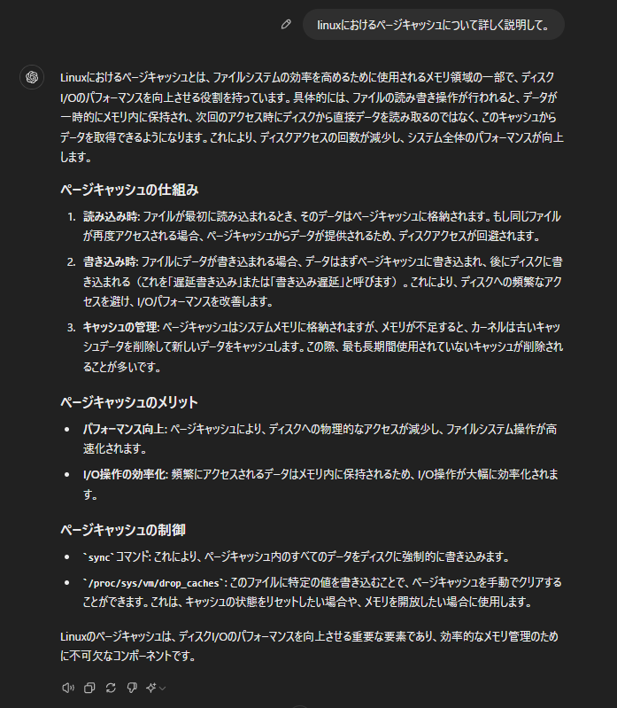
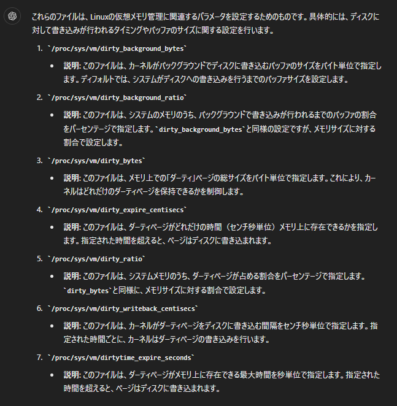

# json_dump_compare
そこそこ巨大なjsonデータの書き出し時のパフォーマンスについて計測比較してみた。

# 環境
- Ubuntu24.04
- CPU: 4, Memory: 8GB

## 使用データ
- 自前のサンプルデータ（sample_data）
- kaggle dataset (combined_dataset.json) : https://www.kaggle.com/datasets/melissamonfared/mental-health-counseling-conversations-k

## パフォーマンス計測

### 結果

```bash
$ python compare.py
Data: sample_data
json.dump()   : 1.0695 s
json.dumps()  : 0.2372 s
ujson.dump()  : 0.1255 s
ujson.dumps() : 0.1083 s
orjson.dumps(): 0.0383 s
orjson.dumps(): 0.0488 s, with cast string
Data: combined_dataset.json
json.dump()   : 1.8624 s
json.dumps()  : 1.6140 s
ujson.dump()  : 1.1164 s
ujson.dumps() : 1.1160 s
orjson.dumps(): 0.3963 s
orjson.dumps(): 0.9930 s, with cast string
```

```bash
$ python mem_compare.py
Data: sample_data, json_dumps
json.dumps()  : 2.1659 s
Data: combined_dataset.json, json_dumps
json.dumps()  : 8.0363 s
Data: sample_data, orjson_dumps
orjson.dumps(): 0.4271 s
Data: combined_dataset.json, orjson_dumps
orjson.dumps(): 1.8267 s
```

```bash
$ python mem_compare_non_disk_write.py
Data: sample_data, json_dumps
json.dumps()  : 1.9712 s
Data: combined_dataset.json, json_dumps
json.dumps()  : 6.1149 s
Data: sample_data, orjson_dumps
orjson.dumps(): 0.3023 s
Data: combined_dataset.json, orjson_dumps
orjson.dumps(): 0.9342 s
```

```bash
# Command
$ awk '
/^Cached:|^Active\(file\):|^Inactive\(file\):/ {
    printf "%-20s %10.2f GB\n", $1, $2 / 1024 / 1024
}' /proc/meminfo

# $ sync; echo 3 | sudo tee /proc/sys/vm/drop_caches 実行後
Cached:                    0.17 GB
Active(file):              0.09 GB
Inactive(file):            0.07 GB

# キャッシュクリアして $ python mem_compare.py 実行後
Cached:                    2.50 GB
Active(file):              0.13 GB
Inactive(file):            2.38 GB

# キャッシュクリアして $ python mem_compare_non_disk_write.py 実行後
Cached:                    0.20 GB
Active(file):              0.12 GB
Inactive(file):            0.08 GB
```

### 使い方

```bash
$ docker-compose up -d

$ python3 -m venv .venv
$ source .venv/bin/activate
$ pip install -r requirements.txt

$ python compare.py
$ python compare_contents.py
$ python mem_compare.py
$ python mem_compare_non_disk_write.py
```

- netadata URL: http://localhost:19999

### 考察

- json.dumpが特に遅い
- ディスク書き込みをするとページキャッシュがそこそこ大きくなる（長らくクリアされなさそう）
- 2回目実行すると謎にキャッシュがリフレッシュされて実行される

### ページキャッシュとは


## 番外編

### ディスク書き込みした際のページキャッシュの動作を調べてみる

```bash
# flush, closeではクリアされなかった。
with open("json_dumps.json", "w") as f:
    f.write(json_data)
    f.flush()
    f.close()
```

```bash
# 1. $ python cache-test1.py を実行した後
# ※ujson, jsonに置き換えても同じ結果になる
Cached:                    2.34 GB
Active(file):              0.05 GB
Inactive(file):            2.29 GB
```

```bash
# 2. (1)を実施して、combined_dataset: 500 → 50 ループに変えて
# $ python cache-test1.py を実行した後
Cached:                    0.55 GB
Active(file):              0.07 GB
Inactive(file):            0.48 GB
```

```bash
# 3. (1)を実施して、
# $ python cache-test2.py を実行した後
# ※ combined_dataset: 500 → 50 ループで、出力ファイルをorjson_dumps.tmp.jsonとしている。
Cached:                    2.72 GB
Active(file):              0.07 GB
Inactive(file):            2.66 GB
```

```bash
# 4. (1)を実施して、
# $ python cache-test3.py を実行した後
# combined_dataset: 500 → 100 ループで、
# 出力ファイルをorjson_dumps.tmp2.json, orjson_dumps.tmp3.json ... orjson_dumps.tmp8.jsonとして実行していく。
# この辺りから、これ以上キャッシュが増えなくなった。
Cached:                    4.37 GB
Active(file):              0.28 GB
Inactive(file):            4.10 GB
```

5. 作成されたファイルを削除するとキャッシュもクリアされた。

### ページキャッシュはずっとクリアされないのか？


```bash
# デフォルト値
/proc/sys/vm/dirty_background_bytes
0
/proc/sys/vm/dirty_background_ratio
10
/proc/sys/vm/dirty_bytes
0
/proc/sys/vm/dirty_expire_centisecs
3000
/proc/sys/vm/dirty_ratio
20
/proc/sys/vm/dirty_writeback_centisecs
500
/proc/sys/vm/dirtytime_expire_seconds
43200

$ cat /proc/sys/vm/vfs_cache_pressure
100
```


- test
```bash
$ sudo vim /etc/sysctl.d/99-custom.conf
vm.dirty_background_ratio=1
vm.dirty_ratio=1
vm.vfs_cache_pressure=1000

$ sudo sysctl --system
$ sysctl vm.dirty_background_ratio
$ sysctl vm.dirty_ratio
$ sysctl vm.vfs_cache_pressure

$ awk '
/^Cached:|^Active\(file\):|^Inactive\(file\):/ {
    printf "%-20s %10.2f GB\n", $1, $2 / 1024 / 1024
}' /proc/meminfo
```

- 2時間放置したがキャッシュクリアされなかった
- 色々調べて、よくわからんけど消えなそう


### ディスク書き込みした際のページキャッシュは処理終了後にクリアできないのか？
- 意図してクリアする方法が `sync; echo 3 | sudo tee /proc/sys/vm/drop_caches` を実行させるしかなさそう

### どうするか
- そもそもGB単位のjsonファイルをそのままダンプする状況が滅多になさそう。
  - 再度処理が走るとクリアされることもあるので、ずっと増え続けることはなさそう。
- チャンク分割で回避できる。チャンク分割の方が高速かも。
  - 結論、数MBからこれをチャンク分割をするで良い気がする

```bash
$ python cache-test4.py
```
